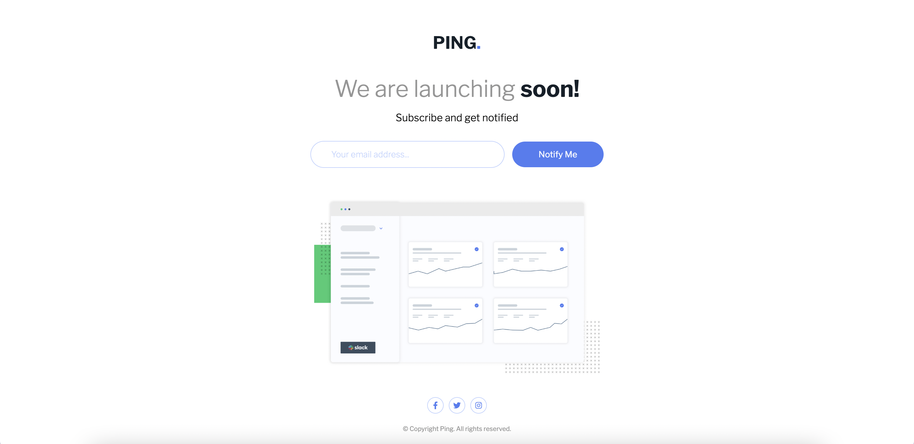

# Frontend Mentor - Ping coming soon page solution

This is a solution to the [Ping coming soon page challenge on Frontend Mentor](https://www.frontendmentor.io/challenges/ping-single-column-coming-soon-page-5cadd051fec04111f7b848da). Frontend Mentor challenges help you improve your coding skills by building realistic projects. 

## Table of contents

- [Overview](#overview)
  - [The challenge](#the-challenge)
  - [Screenshot](#screenshot)
  - [Links](#links)
- [My process](#my-process)
  - [Built with](#built-with)
  - [What I learned](#what-i-learned)
  - [Continued development](#continued-development)
- [Author](#author)

## Overview

### The challenge

Users should be able to:

- View the optimal layout for the site depending on their device's screen size
- See hover states for all interactive elements on the page
- Submit their email address using an `input` field
- Receive an error message when the `form` is submitted if:
	- The `input` field is empty. The message for this error should say *"Whoops! It looks like you forgot to add your email"*
	- The email address is not formatted correctly (i.e. a correct email address should have this structure: `name@host.tld`). The message for this error should say *"Please provide a valid email address"*

### Screenshot

### Links

- Solution URL: [https://www.frontendmentor.io/solutions/ping-coming-soon-page-with-javascript-form-validation-TLC6pvpTRv](https://www.frontendmentor.io/solutions/ping-coming-soon-page-with-javascript-form-validation-TLC6pvpTRv)
- Live Site URL: [https://coder-txane.github.io/ping-coming-soon-page-master/](https://coder-txane.github.io/ping-coming-soon-page-master/)

## My process

### Built with

- Semantic HTML5 markup
- CSS custom properties
- Flexbox
- Mobile-first workflow
- JavaScript

### What I learned

In this project, I learned how to add and amend icons. Initially I used 'Icons8' to get my icons but found that I couldn't change the icons' fill color on hover states. So I switched to using icons from 'Font Awesome' and made it work. Moreover, I've become more confident working with form validation.

### Continued development

The areas I intend on learning include:
- Form Validation
- Icons and changing their states

## Author

- Frontend Mentor - [@coder-txane](https://www.frontendmentor.io/profile/coder-txane)